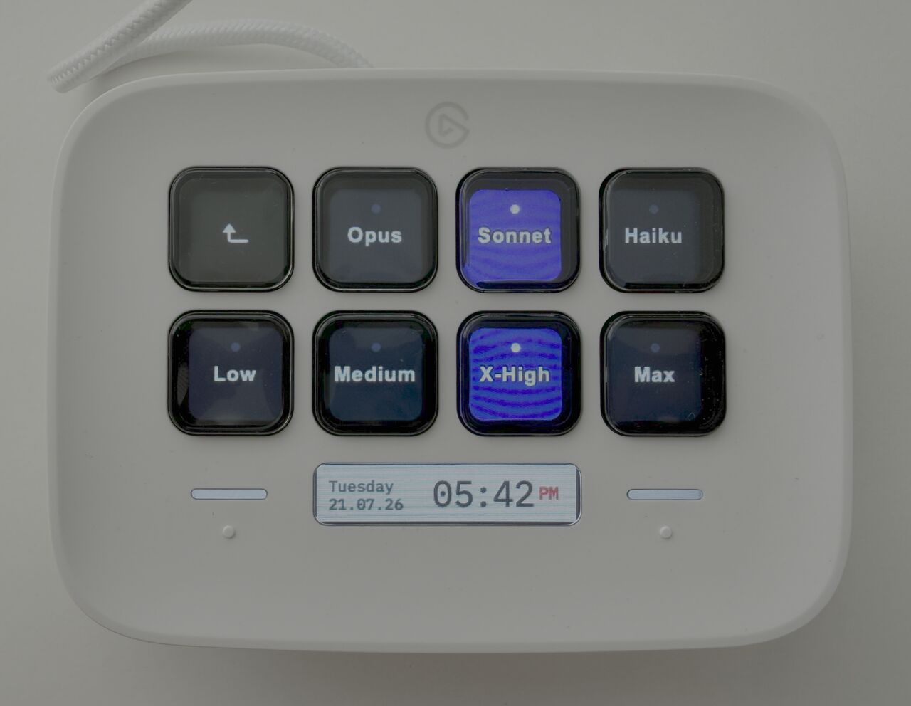

# Claude Code Control — Stream Deck plugin

[](https://github.com/linus-amg/streamdeck-claude-code/actions/workflows/ci.yml)
[](https://github.com/linus-amg/streamdeck-claude-code/releases/latest)

Steer a **live, interactive Claude Code session** from your Elgato Stream Deck:
switch the model, set reasoning effort, toggle fast mode, and fire off skills —
without touching the keyboard.



## How it works

Claude Code has no local socket/IPC to poke a running session, but `/model`,
`/effort`, `/fast`, and `/skill-name` are all slash commands that apply
**immediately mid-session** (Claude Code v2.1.205+). So the plugin injects the
slash command by **typing it into the focused terminal** via macOS System
Events (`osascript`):

```
Stream Deck key ─▶ plugin (Node) ─▶ osascript: keystroke "/effort high"
                                     key code 36   (Return)
```

Run `claude` however you normally do — no wrapper, no tmux. The plugin types
into whichever terminal is frontmost (or force a specific app first, see
**Activate app**).

The plugin is the source of truth for the current selection (Claude Code doesn't
report it back), so the model/effort keys light up to show what was last sent.

## Actions

| Action | Sends | Notes |
| --- | --- | --- |
| **Set Model** | `/model opus\|sonnet\|haiku\|fable` | Active model highlighted |
| **Set Effort** | `/effort low\|medium\|high\|xhigh\|max\|ultracode` | Active level highlighted |
| **Fast Mode** | `/fast on\|off` | 2-state toggle |
| **Run Skill** | any `/command` (e.g. `/prepare`) | one key per skill |
| **Send Text / Key** | literal text, or a key (`Escape`, `C-c`, `Up`) | escape hatch |
| **Voice** | drives Claude Code's native `/voice` dictation | push-to-talk, tap toggle, or enable |

## Prerequisites

- macOS
- Claude Code **v2.1.205+**
- Elgato Stream Deck app **7.1+**
- **Accessibility permission** for the Stream Deck app (see below)
- Node.js **20+** for the dev/build toolchain (the plugin runs on Stream Deck's
  bundled Node)

### Grant Accessibility permission

System Events keystroke injection requires it. On first key press macOS may
prompt; otherwise enable it manually:

**System Settings → Privacy & Security → Accessibility → enable “Elgato Stream Deck”.**

Without it, keys flash yellow ⚠ and nothing is typed.

## Install

Download the latest **`.streamDeckPlugin`** from the
[latest release](https://github.com/linus-amg/streamdeck-claude-code/releases/latest)
and double-click it to install in the Stream Deck app. Then grant Accessibility
permission (above) and add the actions to your keys.

## Build from source

```bash
npm install
npm run build                  # bundles src -> com.linus.claude-code-control.sdPlugin/bin/plugin.js

npm install -g @elgato/cli
streamdeck link com.linus.claude-code-control.sdPlugin
streamdeck restart com.linus.claude-code-control

# iterate with hot reload:
npm run watch
```

> A newly **linked** plugin only appears in the Stream Deck app's action list
> after the app rescans it — quit and reopen Stream Deck once. Afterwards,
> `npm run watch` hot-reloads code changes without an app restart (manifest
> changes still need an app restart).

Then in the Stream Deck app, open the **Keys** tab, find the **Claude Code
Control** category, and drag actions onto keys.

Package a distributable locally:

```bash
npm run validate
npm run package   # -> com.linus.claude-code-control.streamDeckPlugin
```

## Releasing

Every push/PR to `main` runs type-check, build, and plugin validation via
GitHub Actions (`.github/workflows/ci.yml`).

To cut a release, bump `Version` in `manifest.json`, then push a `v*` tag:

```bash
git tag v0.1.0
git push origin v0.1.0
```

`.github/workflows/release.yml` builds, packages the `.streamDeckPlugin`, and
attaches it to an auto-generated GitHub Release. Double-click the downloaded
`.streamDeckPlugin` to install it in the Stream Deck app.

## Configuration (shared, in every Property Inspector → “Behaviour”)

| Setting | Default | Purpose |
| --- | --- | --- |
| **Activate app** | _(blank)_ | Leave blank to type into whatever window is focused (no focus stealing). Set an app name (e.g. `Zed`, `Ghostty`) only if you want keys forced to that app. |
| **Submit delay (ms)** | `300` | Wait between typing and Return (raise for long commands) |
| **Clear line first** | off | Send `Escape` to clear stray input before typing |

Per-key settings: **Set Model** → model; **Set Effort** → level; **Run Skill** →
the `/command` (+ optional label, and whether to press Enter); **Send Text/Key**
→ value + mode (`text` types it, `key` sends `Escape`/`C-c`/arrows/etc.).

## Voice dictation

The **Voice** action drives Claude Code's built-in [`/voice`](https://code.claude.com/docs/en/voice-dictation)
dictation (streamed to Anthropic, coding-tuned, no token cost) — no third-party
speech-to-text needed. Pick a gesture in the key's Property Inspector:

- **Push-to-talk** — hold the key while you speak; release to send.
- **Tap toggle** — press to start, press again to send.
- **Enable voice mode** — sends `/voice tap` to turn dictation on.

**Setup (once per session):** press an **Enable voice mode** key (or type
`/voice tap`), and grant your terminal microphone access on first use
(System Settings → Privacy & Security → Microphone). Voice needs a Claude.ai
login (not an API key).

> Why tap mode under the hood: Claude's native *hold* mode detects a real
> key-**hold** via OS key-repeat, which a synthetic keypress can't produce — so
> both gestures use `/voice tap` (a single injected Space tap to start and to
> stop). If you rebound `voice:pushToTalk` off Space, set the same key in the
> action's **Voice key** field.

## Suggested layout

- Row 1: **Opus / Sonnet / Haiku** (Set Model)
- Row 2: **Low / High / Max** (Set Effort) + **Fast** toggle
- A folder of **Run Skill** keys: `/prepare`, `/lintfix`, `/release`, …

## Troubleshooting

- **Yellow ⚠ on a key** — `osascript` failed, almost always missing Accessibility
  permission for the Stream Deck app (see above). Check the plugin log in
  `com.linus.claude-code-control.sdPlugin/logs/`.
- **Typed into the wrong window** — set **Activate app** to your terminal
  (`Ghostty`), or make sure the terminal is focused before pressing.
- **Command typed but not submitted** — increase the submit delay.
